<div align="center">

# 🚀 Toolify-code

[](LICENSE)
[](https://www.python.org/downloads/)
[](https://fastapi.tiangolo.com/)
[](https://react.dev/)
[](https://www.typescriptlang.org/)

**Empower any LLM with Function Calling + Visual Admin Interface**

[English](README.md) | [简体中文](README_zh.md)

[Quick Start](#-quick-start) • [Features](#-key-features) • [Documentation](#-usage) • [Admin UI](#-web-admin-interface) • [Contributing](#-contributing)

---

### 📊 Project Origin & Acknowledgments

> Based on [funnycups/toolify](https://github.com/funnycups/toolify)  
> Special thanks to **FunnyCups** for creating the excellent Toolify middleware

### ✨ Key Enhancements

- 🎨 **Web Admin UI** - React 19 + TypeScript visual configuration
- ⚡ **Real-time Reload** - Config changes take effect instantly
- 🔄 **Multi-Channel Failover** - Smart priority-based routing
- 🌐 **Multi-API Support** - OpenAI + Anthropic + Gemini formats (3-way conversion!)
- 🔍 **Capability Detection** - Test AI provider capabilities automatically
- 🧠 **Reasoning Budget** - Smart conversion between reasoning_effort and thinking tokens
- 📱 **Responsive Design** - Perfect for mobile and desktop

</div>

---

## 📖 Introduction

**Toolify-code** is a powerful LLM function calling middleware proxy designed for enterprise applications. It injects OpenAI-compatible function calling capabilities into Large Language Models through **Prompt Injection** technology, while providing a modern web-based admin interface for visual configuration management.

## ✨ Key Features

<table>
<tr>
<td width="50%">

### 🎯 Function Calling

- 🔌 **Universal Support** - Inject function calling into any LLM
- 📦 **Multi-Function** - Execute multiple functions concurrently
- ⚡ **Flexible Trigger** - Initiate calls at any stage
- 🧠 **Think Tag Safe** - Seamlessly handle thinking process
- 🌊 **Streaming** - Full streaming support with real-time parsing
- 🎨 **Context Enhanced** - Improved model understanding

</td>
<td width="50%">

### 🛡️ Enterprise Features

- 🔄 **Multi-Channel Failover** - Smart priority-based routing
- 🌐 **Multi-API Format** - OpenAI + Anthropic + Gemini (3-way conversion)
- 🔍 **Capability Detection** - Automated testing of AI features
- 🧠 **Reasoning Budget** - Intelligent effort/token conversion
- 🔐 **Secure Auth** - JWT Token + bcrypt encryption
- ⚡ **Real-time Reload** - Zero-downtime config updates
- 📊 **Visual Management** - Modern web interface
- 📱 **Responsive** - Works on desktop, tablet, mobile

</td>
</tr>
</table>

## How It Works

1. **Intercept Request**: Toolify intercepts API requests (OpenAI/Anthropic/Gemini formats), which includes the desired tools.
2. **Format Detection**: Automatically detects the source API format based on request structure.
3. **Inject Prompt**: Generates a specific system prompt instructing the LLM how to output function calls using XML format.
4. **Convert & Proxy**: Converts request to target format and proxies to configured upstream LLM service.
5. **Parse Response**: Analyzes upstream response. If trigger signal is detected, parses XML structure to extract function calls.
6. **Format Response**: Transforms tool calls to match the client's expected format and sends back.

## 🌐 Supported API Formats

| Format | Request Endpoint | Response Format | Auth Method |
|--------|-----------------|-----------------|-------------|
| **OpenAI** | `POST /v1/chat/completions` | OpenAI JSON | `Authorization: Bearer` |
| **Anthropic** | `POST /v1/messages` | Anthropic JSON | `x-api-key` header |
| **Gemini** | `POST /v1beta/models/{model}:generateContent` | Gemini JSON | `key` parameter |

**Format Conversion Matrix:**

```
     OpenAI ←→ Anthropic ←→ Gemini
       ↑           ↑           ↑
       └───────────┴───────────┘
            All directions supported!
```

## 🏗️ Architecture

### System Architecture Diagram


### Request Flow

```mermaid
sequenceDiagram
    participant C as Client
    participant M as Main (FastAPI)
    participant A as Anthropic Adapter
    participant MP as Message Processor
    participant FC as Function Calling
    participant R as Router
    participant U as Upstream LLM
    participant SP as Stream Proxy

    alt OpenAI Format Request
        C->>M: POST /v1/chat/completions
        M->>MP: Preprocess messages
    else Anthropic Format Request
        C->>M: POST /v1/messages
        M->>A: Convert Anthropic → OpenAI
        A->>MP: Converted request
    end
    
    MP->>FC: Generate function prompt
    FC-->>M: Injected system prompt
    M->>R: Find upstream service
    R-->>M: Priority-sorted upstreams
    
    alt Non-Streaming
        M->>U: Forward request (OpenAI format)
        U-->>M: Complete response
        M->>FC: Parse XML if detected
        FC-->>M: Converted tool_calls
        
        alt OpenAI Client
            M-->>C: Standard OpenAI format
        else Anthropic Client
            M->>A: Convert OpenAI → Anthropic
            A-->>C: Anthropic format response
        end
    else Streaming
        M->>SP: Start streaming
        SP->>U: Stream request
        U-->>SP: Streaming chunks
        SP->>FC: Detect & parse on-the-fly
        FC-->>SP: Tool calls chunks
        
        alt OpenAI Client
            SP-->>C: OpenAI stream
        else Anthropic Client
            SP->>A: Convert stream format
            A-->>C: Anthropic stream
        end
    end
```



### Core Module Overview

| Module | Responsibility | Key Features |
|--------|---------------|--------------|
| **function_calling/** | Function call engine | Prompt injection, XML parsing, streaming detection |
| **models.py** | Data validation | Pydantic models for type safety |
| **token_counter.py** | Token management | Accurate counting for 20+ models |
| **upstream_router.py** | Service routing | Priority-based failover, smart retry |
| **streaming_proxy.py** | Stream handling | Real-time parsing, chunk management |
| **anthropic_adapter.py** | Format conversion | Seamless OpenAI ↔ Anthropic translation |
| **message_processor.py** | Message prep | Tool result formatting, validation |
| **tool_mapping.py** | Call tracking | TTL cache, LRU eviction |

## Installation and Setup

You can run Toolify using Docker Compose or Python directly.

### Option 1: Using Docker Compose

This is the recommended way for easy deployment.

#### Prerequisites

- Docker and Docker Compose installed.

#### Steps

1. **Clone the repository:**

   ```bash
   git clone https://github.com/ImogeneOctaviap794/Toolify-code.git
   cd Toolify-code
   ```

2. **Configure the application:**

   Copy the example configuration file and edit it:

   ```bash
   cp config.example.yaml config.yaml
   ```

   Edit `config.yaml`. Make sure to add `admin_authentication` configuration (for the web admin interface):

   ```yaml
   admin_authentication:
     username: "admin"
     password: "$2b$12$..."  # Use init_admin.py to generate
     jwt_secret: "your-secure-random-jwt-secret-min-32-chars"
   ```

   Or use the `init_admin.py` script to generate automatically:

   ```bash
   python init_admin.py
   ```

3. **Start the service:**

   ```bash
   docker-compose up -d --build
   ```

   This will build the Docker image (including the frontend admin interface) and start the Toolify service in detached mode.

   - API Service: `http://localhost:8000`
   - Admin Interface: `http://localhost:8000/admin`

   **Note**: The frontend will be compiled during Docker build, which may take a few minutes on first build.

### Option 2: Using Python

#### Prerequisites

- Python 3.8+

#### Steps

1. **Clone the repository:**

   ```bash
   git clone https://github.com/funnycups/toolify.git
   cd toolify
   ```

2. **Install dependencies:**

   ```bash
   pip install -r requirements.txt
   ```

3. **Configure the application:**

   Copy the example configuration file and edit it:

   ```bash
   cp config.example.yaml config.yaml
   ```

   Edit `config.yaml` to set up your upstream services, API keys, and allowed client keys.

4. **Run the server:**

   ```bash
   python main.py
   ```

## Configuration (`config.yaml`)

Refer to [`config.example.yaml`](config.example.yaml) for detailed configuration options.

- **`server`**: Middleware host, port, and timeout settings.
- **`upstream_services`**: List of upstream LLM providers (e.g., Groq, OpenAI, Anthropic).
  - Define `base_url`, `api_key`, supported `models`, and set one service as `is_default: true`.
- **`client_authentication`**: List of `allowed_keys` for clients accessing this middleware.
- **`features`**: Toggle features like logging, role conversion, and API key handling.
  - `key_passthrough`: Set to `true` to directly forward the client-provided API key to the upstream service, bypassing the configured `api_key` in `upstream_services`.
  - `model_passthrough`: Set to `true` to forward all requests directly to the upstream service named 'openai', ignoring any model-based routing rules.
  - `prompt_template`: Customize the system prompt used to instruct the model on how to use tools.

## Usage

Once Toolify is running, configure your client application (e.g., using the OpenAI SDK) to use Toolify's address as the `base_url`. Use one of the configured `allowed_keys` for authentication.

```python
from openai import OpenAI

client = OpenAI(
    base_url="http://localhost:8000/v1",  # Toolify endpoint
    api_key="sk-my-secret-key-1"          # Your configured client key
)

# The rest of your OpenAI API calls remain the same, including tool definitions.
```

Toolify handles the translation between the standard OpenAI tool format and the prompt-based method required by unsupported LLMs.

## Multi-Channel Priority & Failover

Toolify Admin supports configuring multiple upstream channels for the same model with priority-based automatic failover, significantly improving service availability and stability.

### Features

- **Priority Mechanism**: Configure `priority` value for each service (higher number = higher priority, 100 > 50)
- **No Default Service Required**: Removed `is_default` requirement, automatically uses highest priority service as fallback
- **Automatic Failover**: Automatically try next priority channel when high-priority channel fails
- **Smart Retry Strategy**:
  - For 429 (rate limit) and 5xx (server errors): Automatically switch to backup channel
  - For 400/401/403 (client errors): No retry (would fail on other channels too)
- **Same Model Multi-Channel**: Configure multiple OpenAI proxies or mirrors for the same model
- **Transparent Switching**: Completely transparent to clients, handles all failover logic automatically

### Configuration Example

```yaml
upstream_services:
  # Primary channel - highest priority
  - name: "openai-primary"
    base_url: "https://api.openai.com/v1"
    api_key: "your-primary-key"
    priority: 100  # Highest priority (higher number = higher priority)
    models:
      - "gpt-4"
      - "gpt-4o"
      - "gpt-3.5-turbo"
  
  # Backup channel - second priority
  - name: "openai-backup"
    base_url: "https://api.openai-proxy.com/v1"
    api_key: "your-backup-key"
    priority: 50  # Second priority
    models:
      - "gpt-4"
      - "gpt-4o"
  
  # Third priority channel
  - name: "openai-fallback"
    base_url: "https://another-proxy.com/v1"
    api_key: "your-fallback-key"
    priority: 10
    models:
      - "gpt-4"
```

### Workflow

1. Request `gpt-4` model
2. System first tries `priority: 100` channel (openai-primary) - highest priority
3. If returns 429 or 500+ error, automatically switches to `priority: 50` channel (openai-backup)
4. If still fails, continues to try `priority: 10` channel (openai-fallback)
5. Only returns error to client when all channels have failed

### Notes

- **Priority Rule**: Higher number = higher priority (recommend using intervals like 100/50/10 for easy insertion of intermediate priorities)
- **Streaming Requests**: Due to the nature of streaming responses, always uses highest priority channel (cannot switch mid-stream)
- **Same Priority**: Multiple services can have same priority, in which case they're tried in config file order
- **Model Matching**: Only services configured with the same model participate in failover
- **is_default Deprecated**: No longer need to set default service, system automatically uses highest priority service as fallback

## Web Admin Interface

Toolify provides a modern web-based admin interface for easy configuration management through your browser.

### Initialize Admin Account

Before using the admin interface, initialize an admin account:

```bash
python init_admin.py
```

Follow the prompts to enter a username and password. The script will automatically generate a hashed password and JWT secret, then update your `config.yaml` file.

Alternatively, you can manually add the following configuration to `config.yaml`:

```yaml
admin_authentication:
  username: "admin"
  password: "$2b$12$..."  # bcrypt hashed password
  jwt_secret: "your-secure-random-jwt-secret-min-32-chars"
```

### Access Admin Interface

1. Start the Toolify service
2. Open `http://localhost:8000/admin` in your browser
3. Login with your admin credentials

### Features

- 📊 **Server Configuration**: Manage host, port, and timeout settings
- 🔄 **Upstream Services**: Add, edit, and remove upstream LLM service configurations
- 🔑 **Client Authentication**: Manage client API keys
- ⚙️ **Feature Configuration**: Toggle feature flags and behavior parameters
- 💾 **Real-time Saving**: Changes are saved directly to `config.yaml`
- 🔐 **Secure Authentication**: JWT-based secure login system

### Frontend Development

If you need to modify the admin interface frontend:

```bash
# Install dependencies
cd frontend
npm install

# Development mode (with hot reload)
npm run dev

# Build for production
npm run build

# Or use the build script
cd ..
./build_frontend.sh
```

Frontend Tech Stack:
- React 19 + TypeScript
- Vite build tool
- Tailwind CSS + shadcn/ui component library

## 🔍 Capability Detection

Toolify includes a powerful capability detection system to test AI provider features automatically:

```python
# Use the capability detection API
POST /api/detect/capabilities
{
  "provider": "openai",  // or "anthropic", "gemini"
  "api_key": "your-key",
  "base_url": "https://api.openai.com/v1",  // optional
  "model": "gpt-4o"  // optional
}
```

**Detectable Capabilities:**
- ✅ Basic chat completion
- ✅ Streaming responses
- ✅ Function calling / Tool use
- ✅ Vision / Image understanding
- ✅ System messages
- ✅ JSON mode / Structured output

## 🧠 Reasoning Budget Conversion

Toolify automatically converts reasoning parameters between different formats:

| OpenAI | Anthropic | Gemini | Description |
|--------|-----------|--------|-------------|
| `reasoning_effort: "low"` | `thinkingBudget: 2048` | `thinkingBudget: 2048` | Light reasoning |
| `reasoning_effort: "medium"` | `thinkingBudget: 8192` | `thinkingBudget: 8192` | Moderate reasoning |
| `reasoning_effort: "high"` | `thinkingBudget: 16384` | `thinkingBudget: 16384` | Deep reasoning |

**Example:**
```python
# Client sends OpenAI format with reasoning_effort
{
  "model": "o1-preview",
  "reasoning_effort": "high",
  "messages": [...]
}

# Toolify automatically converts to Anthropic/Gemini
{
  "model": "claude-3-opus",
  "thinkingBudget": 16384,  # Auto-converted!
  "messages": [...]
}
```

## Configuration Examples

### Multi-Provider Configuration

```yaml
upstream_services:
  # OpenAI Service
  - name: "openai-primary"
    service_type: "openai"
    base_url: "https://api.openai.com/v1"
    api_key: "sk-..."
    priority: 100
    models: ["gpt-4", "gpt-4o", "o1-preview"]
  
  # Anthropic Claude Service
  - name: "anthropic-claude"
    service_type: "anthropic"
    base_url: "https://api.anthropic.com"
    api_key: "sk-ant-..."
    priority: 90
    models: ["claude-3-5-sonnet-20241022", "claude-3-opus"]
  
  # Google Gemini Service
  - name: "google-gemini"
    service_type: "gemini"
    base_url: "https://generativelanguage.googleapis.com/v1beta"
    api_key: "AI..."
    priority: 80
    models: ["gemini-2.0-flash-exp", "gemini-1.5-pro"]
```

### Per-Service Function Calling Control

```yaml
upstream_services:
  - name: "openai-with-injection"
    inject_function_calling: true    # Enable Toolify injection
    optimize_prompt: true             # Use optimized prompt
    
  - name: "openai-native"
    inject_function_calling: false   # Use native function calling API
```

### Model Redirection

```yaml
upstream_services:
  - name: "openai"
    model_mapping:
      gpt-4: gpt-4o           # Client requests gpt-4 → Actually use gpt-4o
      gpt-3.5: gpt-4o-mini    # Client requests gpt-3.5 → Actually use gpt-4o-mini
      claude-2: claude-3      # Works with model names
```

### Prompt Optimization

When enabled, function calling prompts are simplified:
- **Detailed Mode** (default): 50,679 chars, ~12,669 tokens (17 tools)
- **Optimized Mode**: ~15,000 chars, ~4,000 tokens (17 tools)
- **Savings**: 60-70% reduction in prompt tokens ✅

## License

This project is licensed under the GPL-3.0-or-later license.