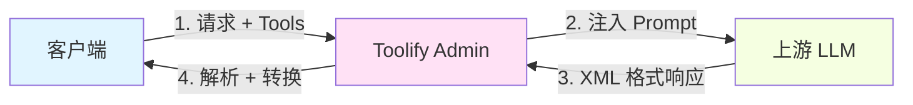
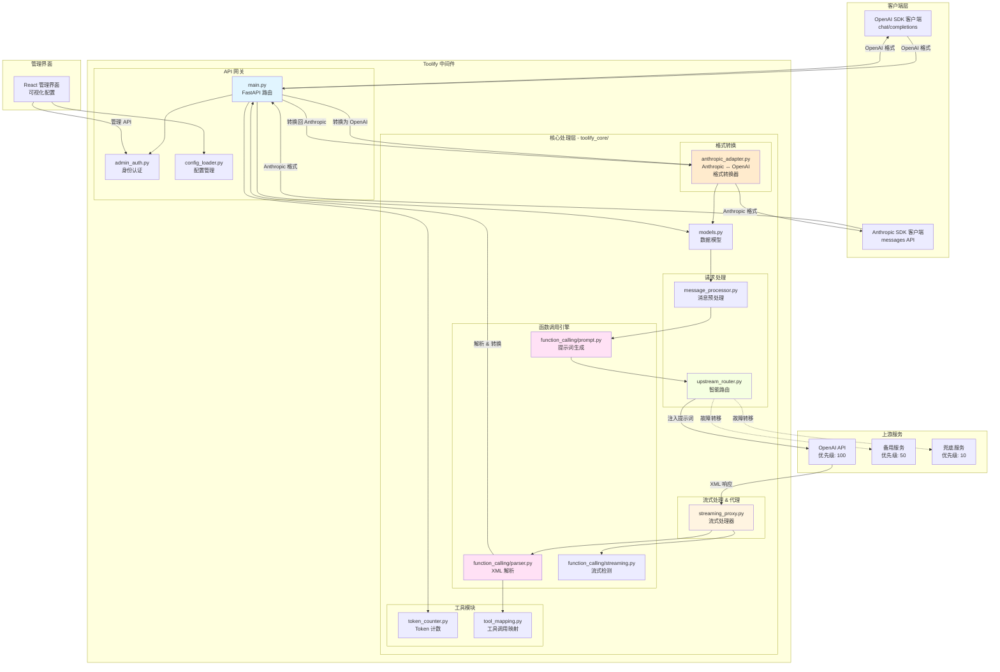
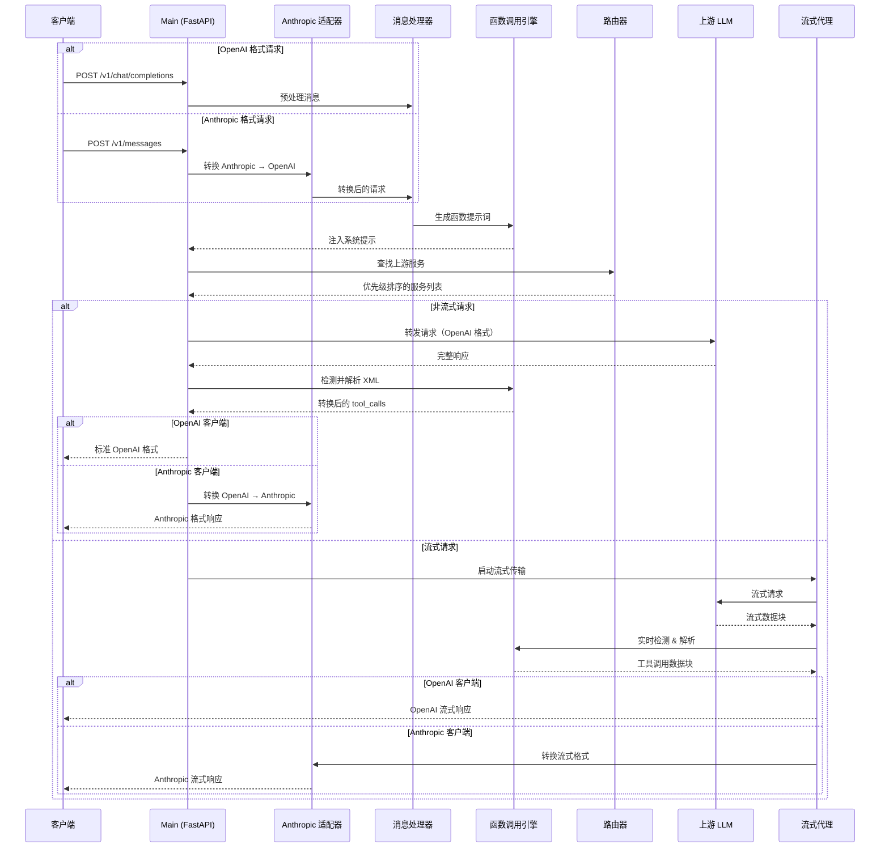

<div align="center">

# 🚀 Toolify-code

[](LICENSE)
[](https://www.python.org/downloads/)
[](https://fastapi.tiangolo.com/)
[](https://react.dev/)
[](https://www.typescriptlang.org/)

**为任何 LLM 注入函数调用能力 + 可视化配置管理界面**

[English](README.md) | [简体中文](README_zh.md)

[快速开始](#-快速开始) • [功能特性](#-核心特性) • [使用文档](#-使用方法) • [管理界面](#-web-管理界面) • [贡献指南](#-贡献)

---

### 📊 项目来源与致谢

> 本项目基于 [funnycups/toolify](https://github.com/funnycups/toolify) 开发  
> 感谢原作者 **FunnyCups** 创建的优秀 Toolify 中间件项目

### ✨ 主要增强

- 🎨 **Web 管理界面** - React 19 + TypeScript 可视化配置
- ⚡ **实时配置重载** - 无需重启即可生效
- 🔄 **多渠道故障转移** - 智能优先级路由
- 🌐 **多 API 格式支持** - OpenAI + Anthropic + Gemini 三向互转！
- 🔍 **能力检测** - 自动测试 AI 提供商功能
- 🧠 **思考预算转换** - 智能转换 reasoning_effort 和 thinking tokens
- 📱 **响应式设计** - 完美适配移动端和桌面端

</div>

---

## 📖 简介

**Toolify-code** 是一个强大的 LLM 函数调用中间件代理，专为企业级应用设计。它通过 **Prompt Injection** 技术为不支持原生函数调用的大型语言模型注入 OpenAI 兼容的函数调用能力，同时提供现代化的 Web 管理界面实现配置的可视化管理。

## ✨ 核心特性

<table>
<tr>
<td width="50%">

### 🎯 函数调用能力

- 🔌 **通用函数调用** - 为任何 LLM 注入 OpenAI 兼容的函数调用
- 📦 **多函数并发** - 单次响应支持多个函数同时执行
- ⚡ **灵活触发** - 模型输出任意阶段都可启动函数调用
- 🧠 **Think 标签兼容** - 无缝处理思考过程，不干扰解析
- 🌊 **流式支持** - 完整支持流式响应，实时解析工具调用
- 🎨 **上下文增强** - 提供工具调用详情，提升模型理解

</td>
<td width="50%">

### 🛡️ 企业级功能

- 🔄 **多渠道故障转移** - 智能优先级路由，自动切换备用通道
- 🌐 **多 API 格式** - OpenAI + Anthropic + Gemini 三向互转
- 🔍 **能力检测** - 自动化 AI 功能测试
- 🧠 **思考预算转换** - 智能 effort/token 转换
- 🔐 **安全认证** - JWT Token + bcrypt 加密管理员系统
- ⚡ **实时重载** - 配置修改立即生效，零停机更新
- 📊 **可视化管理** - 现代 Web 界面，一键配置所有选项
- 📱 **响应式设计** - 完美适配桌面、平板、手机

</td>
</tr>
</table>

## 🔄 工作原理



### 处理流程

| 步骤 | 说明 | 技术细节 |
|------|------|----------|
| 1️⃣ **拦截请求** | 接收客户端的函数调用请求 | 支持 OpenAI/Anthropic 双格式 |
| 2️⃣ **注入提示词** | 生成专属 Prompt 指导模型输出 | 动态触发信号 + XML 模板 |
| 3️⃣ **代理转发** | 转发到配置的上游服务 | 多渠道优先级路由 |
| 4️⃣ **智能解析** | 检测并解析 XML 格式的工具调用 | 支持嵌套、Think 块、流式 |
| 5️⃣ **格式转换** | 转换为标准 OpenAI/Anthropic 格式 | 完整兼容官方 SDK |

## 🏗️ 架构设计

### 系统架构图



### 请求处理流程



### 核心模块概览

| 模块 | 职责 | 核心特性 |
|------|------|---------|
| **function_calling/** | 函数调用引擎 | 提示词注入、XML解析、流式检测 |
| **models.py** | 数据验证 | Pydantic 类型安全模型 |
| **token_counter.py** | Token 管理 | 支持 20+ 模型的精确计数 |
| **upstream_router.py** | 服务路由 | 优先级故障转移、智能重试 |
| **streaming_proxy.py** | 流式处理 | 实时解析、数据块管理 |
| **anthropic_adapter.py** | 格式转换 | OpenAI ↔ Anthropic 无缝转换 |
| **message_processor.py** | 消息预处理 | 工具结果格式化、验证 |
| **tool_mapping.py** | 调用跟踪 | TTL 缓存、LRU 淘汰策略 |

## 🚀 快速开始

### 方式一：Docker 部署（推荐⭐）

<details open>
<summary><b>🐳 使用 Docker Compose 一键部署</b></summary>

#### 📋 前置要求

- ✅ Docker 20.10+
- ✅ Docker Compose 2.0+

#### 🔧 部署步骤

```bash
# 1️⃣ 克隆仓库
git clone https://github.com/ImogeneOctaviap794/Toolify.git
cd Toolify

# 2️⃣ 配置文件
cp config.example.yaml config.yaml

# 3️⃣ 初始化管理员账号（可选）
python init_admin.py

# 4️⃣ 启动服务
docker-compose up -d --build
```

#### ✅ 访问服务

- 🌐 **API 服务**: `http://localhost:8000`
- 🎨 **管理界面**: `http://localhost:8000/admin`
- 👤 **默认账号**: `admin` / `admin123`

> 💡 **提示**: 首次构建会自动编译前端，大约需要 2-3 分钟

</details>

### 方式二：Python 直接运行

<details>
<summary><b>🐍 使用 Python 本地部署</b></summary>

#### 📋 前置要求

- ✅ Python 3.8+  
- ✅ pip 包管理器
- ✅ Node.js 18+（用于构建前端）

#### 🔧 部署步骤

```bash
# 1️⃣ 克隆仓库
git clone https://github.com/ImogeneOctaviap794/Toolify.git
cd Toolify

# 2️⃣ 安装 Python 依赖
pip install -r requirements.txt

# 3️⃣ 配置文件
cp config.example.yaml config.yaml
# 编辑 config.yaml 设置您的上游服务和 API 密钥

# 4️⃣ 初始化管理员（可选）
python init_admin.py

# 5️⃣ 构建前端界面
./build_frontend.sh

# 6️⃣ 启动服务
python main.py
```

#### ✅ 访问服务

- 🌐 **API 服务**: `http://localhost:8000`
- 🎨 **管理界面**: `http://localhost:8000/admin`
- 👤 **默认账号**: `admin` / `admin123`

</details>

## ⚙️ 配置说明

### 配置文件结构

```yaml
# 服务器配置
server:
  port: 8000           # 🔌 监听端口
  host: "0.0.0.0"     # 🌐 监听地址
  timeout: 180         # ⏱️ 请求超时（秒）

# 上游服务配置
upstream_services:
  - name: "openai-primary"
    service_type: "openai"      # 🏷️ 服务类型：openai/google/anthropic
    base_url: "https://api.openai.com/v1"
    api_key: "sk-..."
    priority: 100                # 📊 优先级（数字越大越优先）
    models: ["gpt-4", "gpt-4o"]

# 客户端认证
client_authentication:
  allowed_keys:
    - "sk-your-client-key-1"    # 🔑 允许访问的客户端密钥

# 管理员认证（Web 界面）
admin_authentication:
  username: "admin"              # 👤 管理员用户名
  password: "$2b$12$..."        # 🔐 bcrypt 加密密码
  jwt_secret: "..."             # 🎫 JWT 签名密钥

# 功能配置
features:
  enable_function_calling: true  # 🎯 启用函数调用
  log_level: "INFO"             # 📋 日志级别
  model_passthrough: true       # 🚀 模型透传模式
```

### 📝 配置参数说明

<details>
<summary><b>点击展开详细说明</b></summary>

| 参数 | 说明 | 默认值 |
|------|------|--------|
| `server.port` | 服务监听端口 | `8000` |
| `server.timeout` | 上游请求超时时间（秒） | `180` |
| `upstream_services[].priority` | 服务优先级（数字越大越优先） | `0` |
| `features.enable_function_calling` | 启用函数调用功能 | `true` |
| `features.model_passthrough` | 使用所有服务按优先级路由 | `false` |
| `features.key_passthrough` | 转发客户端 API Key | `false` |

</details>

## 📚 使用方法

### OpenAI 格式调用

<details open>
<summary><b>使用 OpenAI SDK</b></summary>

```python
from openai import OpenAI

# 🔧 配置 Toolify 作为代理
client = OpenAI(
    base_url="http://localhost:8000/v1",
    api_key="sk-my-secret-key-1"  # 您的客户端密钥
)

# 🎯 正常使用，完全兼容 OpenAI API
response = client.chat.completions.create(
    model="gpt-4",
    messages=[
        {"role": "user", "content": "北京天气怎么样？"}
    ],
    tools=[{
        "type": "function",
        "function": {
            "name": "get_weather",
            "description": "获取天气信息",
            "parameters": {
                "type": "object",
                "properties": {
                    "location": {"type": "string"}
                },
                "required": ["location"]
            }
        }
    }]
)
```

</details>

### Anthropic 格式调用

<details>
<summary><b>使用 Anthropic SDK</b></summary>

```python
import anthropic

# 🔧 配置 Toolify 作为代理
client = anthropic.Anthropic(
    api_key="sk-my-secret-key-1",  # 您的客户端密钥
    base_url="http://localhost:8000/v1"
)

# 🎯 使用 Anthropic Messages API
message = client.messages.create(
    model="claude-haiku-4.5",
    max_tokens=1024,
    tools=[{
        "name": "get_weather",
        "description": "获取天气信息",
        "input_schema": {
            "type": "object",
            "properties": {
                "location": {"type": "string", "description": "城市名称"}
            },
            "required": ["location"]
        }
    }],
    messages=[
        {"role": "user", "content": "北京天气怎么样？"}
    ]
)
```

> 💡 **提示**: Toolify 自动处理 Anthropic ↔ OpenAI 格式转换，上游仍然使用 OpenAI 格式

</details>

### cURL 调用示例

<details>
<summary><b>HTTP 直接调用</b></summary>

```bash
# OpenAI 格式
curl -X POST http://localhost:8000/v1/chat/completions \
  -H "Content-Type: application/json" \
  -H "Authorization: Bearer sk-my-secret-key-1" \
  -d '{
    "model": "gpt-4",
    "messages": [{"role": "user", "content": "Hello!"}]
  }'

# Anthropic 格式
curl -X POST http://localhost:8000/v1/messages \
  -H "Content-Type: application/json" \
  -H "Authorization: Bearer sk-my-secret-key-1" \
  -d '{
    "model": "claude-haiku-4.5",
    "max_tokens": 1024,
    "messages": [{"role": "user", "content": "Hello!"}]
  }'
```

</details>

## 🔄 多渠道优先级与故障转移

> 💡 为同一模型配置多个上游渠道，自动故障转移，**99.9%** 服务可用性保障

### 🎯 功能亮点

<table>
<tr>
<td width="33%">

#### 📊 优先级机制
数字越大优先级越高  
`100` > `50` > `10`

</td>
<td width="33%">

#### 🔄 自动切换
429/5xx 错误自动切换  
客户端完全无感知

</td>
<td width="33%">

#### 🎨 灵活配置
支持多个 OpenAI 代理  
镜像站、备用渠道

</td>
</tr>
</table>

### 💡 智能重试策略

| 错误类型 | 处理方式 | 说明 |
|---------|----------|------|
| 🟡 429 Rate Limit | ✅ 自动切换 | 限流时立即使用备用渠道 |
| 🔴 5xx Server Error | ✅ 自动切换 | 服务器错误切换到下一渠道 |
| 🟠 400/401/403 Client Error | ❌ 不重试 | 客户端错误换渠道也会失败 |
| 🔵 Network Timeout | ✅ 自动切换 | 网络超时切换备用服务 |

### 配置示例

```yaml
upstream_services:
  # 主渠道 - 最高优先级
  - name: "openai-primary"
    base_url: "https://api.openai.com/v1"
    api_key: "your-primary-key"
    priority: 100  # 最高优先级（数字越大越优先）
    models:
      - "gpt-4"
      - "gpt-4o"
      - "gpt-3.5-turbo"
  
  # 备用渠道 - 第二优先级
  - name: "openai-backup"
    base_url: "https://api.openai-proxy.com/v1"
    api_key: "your-backup-key"
    priority: 50  # 第二优先级
    models:
      - "gpt-4"
      - "gpt-4o"
  
  # 第三优先级渠道
  - name: "openai-fallback"
    base_url: "https://another-proxy.com/v1"
    api_key: "your-fallback-key"
    priority: 10
    models:
      - "gpt-4"
```

### 工作流程

1. 请求 `gpt-4` 模型
2. 系统首先尝试 `priority: 100` 的渠道（openai-primary）- 最高优先级
3. 如果返回 429 或 500+ 错误，自动切换到 `priority: 50` 的渠道（openai-backup）
4. 如果仍然失败，继续尝试 `priority: 10` 的渠道（openai-fallback）
5. 只有所有渠道都失败时才返回错误给客户端

### 注意事项

- **优先级规则**：数字越大优先级越高（建议使用 100/50/10 这样的间隔，便于后续插入中间优先级）
- **流式请求**：由于流式响应的特性，始终使用最高优先级的渠道（无法中途切换）
- **相同优先级**：多个服务可以有相同的优先级，此时按配置文件中的顺序尝试
- **模型匹配**：只有配置了相同模型的服务才会参与故障转移
- **is_default 已弃用**：不再需要设置默认服务，系统自动使用优先级最高的服务作为兜底

## 🎨 Web 管理界面

<div align="center">

### ✨ 现代化可视化配置管理平台

**React 19 + TypeScript + Tailwind CSS + shadcn/ui**

</div>

### 🖥️ 界面预览

<table>
<tr>
<td width="50%">

#### 🔐 登录界面
- 渐变背景设计
- JWT Token 认证
- bcrypt 密码加密

</td>
<td width="50%">

#### ⚙️ 配置管理
- 实时配置重载
- 表单 / JSON 双模式
- 响应式设计

</td>
</tr>
</table>

### 🚀 快速访问

```bash
# 1️⃣ 初始化管理员账号
python init_admin.py

# 2️⃣ 访问管理界面
# 浏览器打开: http://localhost:8000/admin

# 3️⃣ 使用默认账号登录
# 用户名: admin
# 密码: admin123
```

### 📋 功能模块

<table>
<tr>
<td width="50%">

#### 🖥️ 服务器配置
- 监听地址与端口
- 请求超时设置
- 实时状态监控

#### 🔗 上游服务管理
- 多渠道配置
- 优先级设置
- JSON 批量编辑
- 服务类型标识

</td>
<td width="50%">

#### 🔑 客户端认证
- API Key 管理
- 批量添加/删除
- 密钥可见性控制

#### ⚙️ 功能配置
- 函数调用开关
- 日志级别控制
- 模型透传模式
- 自定义提示词

</td>
</tr>
</table>

### 🛠️ 前端开发指南

<details>
<summary><b>修改管理界面</b></summary>

```bash
# 进入前端目录
cd frontend

# 安装依赖
npm install

# 开发模式（支持热重载）
npm run dev
# 访问 http://localhost:3000

# 构建生产版本
npm run build

# 快速构建脚本
cd ..
./build_frontend.sh
```

#### 🎨 技术栈

| 技术 | 版本 | 用途 |
|------|------|------|
| React | 19 | UI 框架 |
| TypeScript | 5.0+ | 类型安全 |
| Vite | 6.0+ | 构建工具 |
| Tailwind CSS | 3.4+ | 样式框架 |
| shadcn/ui | Latest | 组件库 |
| Zustand | 5.0+ | 状态管理 |

</details>

---

## 📝 配置示例

### 按服务控制函数调用

```yaml
upstream_services:
  - name: "openai-with-injection"
    inject_function_calling: true    # 启用 Toolify 注入
    optimize_prompt: true             # 使用优化 prompt
    
  - name: "openai-native"
    inject_function_calling: false   # 使用原生函数调用 API
```

### 模型重定向

```yaml
upstream_services:
  - name: "openai"
    model_mapping:
      gpt-4: gpt-4o           # 客户端请求 gpt-4 → 实际使用 gpt-4o
      gpt-3.5: gpt-4o-mini    # 客户端请求 gpt-3.5 → 实际使用 gpt-4o-mini
      claude-2: claude-3      # 支持任意模型名
```

### Prompt 优化效果

启用优化模式后，函数调用 prompt 大幅精简：
- **详细模式**（默认）：50,679 字符，约 12,669 tokens（17个工具）
- **优化模式**：约 15,000 字符，约 4,000 tokens（17个工具）
- **节省**：减少 60-70% 的 prompt tokens ✅

## 📄 许可证

本项目采用 **GPL-3.0-or-later** 许可证。

## 🤝 贡献

欢迎提交 Issue 和 Pull Request！

## ⭐ Star History

如果这个项目对您有帮助，请给我们一个 Star ⭐

---

<div align="center">

**Made with ❤️ by Toolify-code Team**

[GitHub](https://github.com/ImogeneOctaviap794/Toolify-code) • [Issues](https://github.com/ImogeneOctaviap794/Toolify-code/issues) • [原项目](https://github.com/funnycups/toolify)

</div>